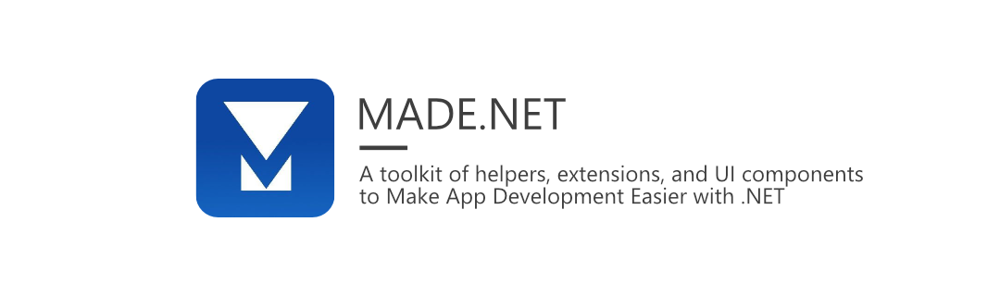

# MADE.NET

MADE.NET is a toolkit of easy-to-use extensions, helpers, and controls to make app development easier for .NET developers.

Whether you're building an ASP.NET Core Web API or a native UI application with Uno Platform, MADE.NET has something for everyone.

MADE.NET has been built on common code from projects built by the MADE team, and is now a home for all those bits of code that you know you will reuse in another project!

## Support MADE.NET ♥

As many developers know, projects like MADE.NET are built and maintained in spare time. If you find this project useful, please **Star** the repo and if possible, sponsor the project development on GitHub.

## Build Status

| Build | Status | Current Version |
| ------ | ------ | ------ |
| GitHub Actions |  |  |

## Installation 💾

[MADE.NET](https://www.nuget.org/profiles/made-apps) components are publicly available via NuGet. Each available package is detailed below.

| Package | Current |
| ------ | ------ |
| Collections |  |
| Data.Converters |  |
| Data.Validation |  |
| Diagnostics |  |
| Networking |  |
| Runtime |  |
| Testing |  |
| Threading |  |
| UI |  |
| UI.Controls.DropDownList |  |
| UI.Controls.FilePicker |  |
| UI.Controls.Validator |  |
| Web |  |

## Contributing 🚀

Looking to help build MADE.NET? Take a look through our [contribution guidelines](CONTRIBUTING.md). We actively encourage you to jump in and help with any issues!

## Building MADE.NET 🛠

MADE.NET is built using .NET Standard, taking advantage of the new SDK-style projects and multi-targeting enabled with the help of [MSBuild.Sdk.Extras](https://github.com/novotnyllc/MSBuildSdkExtras).

You can build the solution using Visual Studio with the following workloads installed:

- .NET desktop development
- Universal Windows Platform development
- Mobile Development with .NET
- .NET Core cross-platform development

## License

MADE.NET is made available under the terms and conditions of the [MIT license](LICENSE).