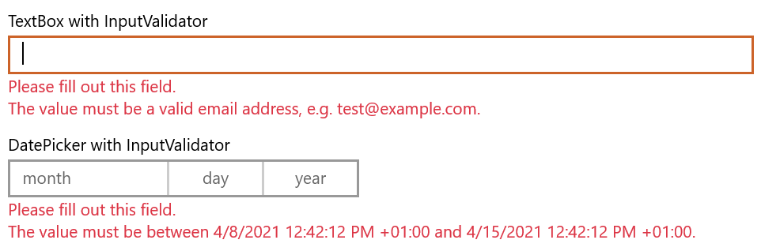

# Using the InputValidator control

The `MADE.UI.Controls.InputValidator` element is a custom-built UI element wrapper for input controls that works with [Uno's supported platforms](https://platform.uno/) that provides an input validation experience.

Shown below is the visuals for the control in its default state validating a `TextBox` and `DatePicker` with input validators from the `MADE.NET.Data.Validation` library.



## Example usage

```xml
<Page
    x:Class="InputValidatorSample.MainPage"
    xmlns="http://schemas.microsoft.com/winfx/2006/xaml/presentation"
    xmlns:x="http://schemas.microsoft.com/winfx/2006/xaml"
    xmlns:controls="using:MADE.UI.Controls"
    xmlns:d="http://schemas.microsoft.com/expression/blend/2008"
    xmlns:mc="http://schemas.openxmlformats.org/markup-compatibility/2006"
    Background="{ThemeResource ApplicationPageBackgroundThemeBrush}"
    mc:Ignorable="d">

    <RelativePanel Padding="12">
        <controls:InputValidator
            x:Name="TextBoxValidator"
            Margin="0,12,0,0"
            Input="{x:Bind TextBox.Text, Mode=TwoWay, UpdateSourceTrigger=PropertyChanged}"
            RelativePanel.AlignLeftWithPanel="True"
            RelativePanel.AlignRightWithPanel="True"
            RelativePanel.AlignTopWithPanel="True">
            <TextBox x:Name="TextBox" Header="TextBox with InputValidator" />
        </controls:InputValidator>

        <controls:InputValidator
            x:Name="DatePickerValidator"
            Margin="0,12,0,0"
            Input="{Binding SelectedDate, Mode=TwoWay, ElementName=DatePicker, UpdateSourceTrigger=PropertyChanged}"
            RelativePanel.AlignLeftWithPanel="True"
            RelativePanel.AlignRightWithPanel="True"
            RelativePanel.Below="TextBoxValidator">
            <DatePicker x:Name="DatePicker" Header="DatePicker with InputValidator" />
        </controls:InputValidator>
    </RelativePanel>
</Page>
```

```csharp
namespace InputValidatorSample
{
    using System;
    using System.Collections.Generic;
    using System.Collections.ObjectModel;
    using System.Diagnostics;
    using global::Windows.UI.Xaml.Controls;
    using MADE.Data.Validation;
    using MADE.Data.Validation.Validators;
    using MADE.UI.Controls;

    public sealed partial class MainPage : Page
    {
        public MainPage()
        {
            this.InitializeComponent();

            this.TextBoxValidator.Validators = new ValidatorCollection 
            { 
                new RequiredValidator(), 
                new EmailValidator(),
            };

            this.DatePickerValidator.Validators = new ValidatorCollection
            {
                new RequiredValidator(), 
                new BetweenValidator(DateTimeOffset.Now, DateTimeOffset.Now.AddDays(7)),
            };
        }
    }
}
```

## Validating an input

The `InputValidator` is designed in a way that it can be used with any input control, whether in-built like `TextBox` or custom-built like the MADE `FilePicker` control. 

Simply, the `Input` property of the validator needs to be bound to the input value reference from the wrapped input control that needs to be validated.

You can then provide a `ValidatorCollection` instance from the [Data Validation package](data-validation.md), containing the `IValidator` instances that will be run on the input. 

This can either be a bound property in your view-model, set in your view code-behind, or defined in your XAML as a static resource.

The implementation of using `IValidator` instances allows you to dynamically configure your validators based on other criteria of your view.

For example, you might want to validate two `DatePicker` controls that define a min/max range. The validator for the maximum date could be dynamically updated so that its minimum value is defined based on the value of the minimum date picker.

## Extending input validation for your application's needs

The validation of the `InputValidator` is based on `IValidator` instances from the Data Validation package.

While the package provides a common set of validators for basic scenarios such as required, range, min, max, and email, you can create your own.

Find more detail on creating your own custom `IValidator` types in our [Data Validation article](data-validation.md#creating-your-own-custom-data-validators).

## Customizing the InputValidator

The control has many customization properties that are exposed to tailor the experience for your application.

### FeedbackMessageStyle

The `FeedbackMessageStyle` controls the styling applied to the `TextBlock` that displays the validator messages. 

The default user experience styling is shown at the top of this article.