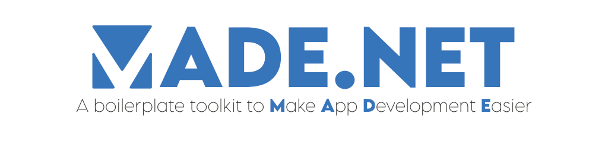

<h2>Why MADE.NET?</h2>

Have you ever built applications and found yourself copying common code, extensions or helpers, from one to another?

That's why I built MADE.NET. This is a toolkit of easy-to-use extensions, helpers, and controls to make app development easier for you, taken straight from the projects I've worked on over the years.

[Learn more](articles/intro.md)

<h2>Available packages</h2>

Take advantage of what is available for MADE.NET in your applications.

You'll discover what packages are available for you from NuGet.org, plus how you can use them.

[Discover MADE.NET](articles/available-packages.md)

<h2>Contributing</h2>

Do you have reusable code you want to share with the world?

MADE.NET is available as an open-source project on GitHub! Dive into the codebase and bring your improvements.

[Get the source](https://github.com/MADE-Apps/MADE.NET)

<h2>Supporting MADE.NET</h2>

If you'd like to support MADE Apps current and future endeavors in open-source projects, considering sponsoring the work we do!

<a aria-label="Sponsor @jamesmcroft" target="_top" href="https://github.com/sponsors/jamesmcroft/">
<svg height="16" class="octicon octicon-heart text-pink mr-2" viewbox="0 0 16 16" version="1.1" width="16" aria-hidden="true">
<path fill-rule="evenodd" d="M4.25 2.5c-1.336 0-2.75 1.164-2.75 3 0 2.15 1.58 4.144 3.365 5.682A20.565 20.565 0 008 13.393a20.561 20.561 0 003.135-2.211C12.92 9.644 14.5 7.65 14.5 5.5c0-1.836-1.414-3-2.75-3-1.373 0-2.609.986-3.029 2.456a.75.75 0 01-1.442 0C6.859 3.486 5.623 2.5 4.25 2.5zM8 14.25l-.345.666-.002-.001-.006-.003-.018-.01a7.643 7.643 0 01-.31-.17 22.075 22.075 0 01-3.434-2.414C2.045 10.731 0 8.35 0 5.5 0 2.836 2.086 1 4.25 1 5.797 1 7.153 1.802 8 3.02 8.847 1.802 10.203 1 11.75 1 13.914 1 16 2.836 16 5.5c0 2.85-2.045 5.231-3.885 6.818a22.08 22.08 0 01-3.744 2.584l-.018.01-.006.003h-.002L8 14.25zm0 0l.345.666a.752.752 0 01-.69 0L8 14.25z"></path>
</svg>
Sponsor on GitHub
</a>

<a aria-label="Buy Me A Coffee @jamesmcroft" target="_top" href="https://buymeacoff.ee/jamesmcroft">
<svg height="16" class="octicon octicon-heart text-pink mr-2" viewbox="0 0 16 16" version="1.1" width="16" aria-hidden="true">
<path fill-rule="evenodd" d="M4.25 2.5c-1.336 0-2.75 1.164-2.75 3 0 2.15 1.58 4.144 3.365 5.682A20.565 20.565 0 008 13.393a20.561 20.561 0 003.135-2.211C12.92 9.644 14.5 7.65 14.5 5.5c0-1.836-1.414-3-2.75-3-1.373 0-2.609.986-3.029 2.456a.75.75 0 01-1.442 0C6.859 3.486 5.623 2.5 4.25 2.5zM8 14.25l-.345.666-.002-.001-.006-.003-.018-.01a7.643 7.643 0 01-.31-.17 22.075 22.075 0 01-3.434-2.414C2.045 10.731 0 8.35 0 5.5 0 2.836 2.086 1 4.25 1 5.797 1 7.153 1.802 8 3.02 8.847 1.802 10.203 1 11.75 1 13.914 1 16 2.836 16 5.5c0 2.85-2.045 5.231-3.885 6.818a22.08 22.08 0 01-3.744 2.584l-.018.01-.006.003h-.002L8 14.25zm0 0l.345.666a.752.752 0 01-.69 0L8 14.25z"></path>
</svg>
Buy Me A Coffee
</a>

